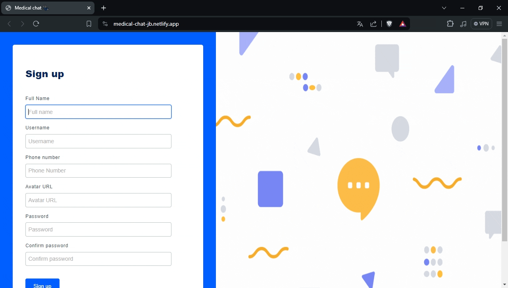

# Medical Chat 🩺

Medical is an online chat application with a medical theme. Inspired by applications like Slack, it meets all the basic functionalities of a chat.

**Deployment**: [Medical chat 🥼](https://medical-chat-jb.netlify.app/)

## Features 👀

- **Real-time messages**: Instant communication between team members.
- **Chat channels**: Organization of conversations by topics or projects.
- **Notifications**: Real-time alerts for new messages and mentions.
- **File Support**: Sharing documents and files directly in the chat.
- **Secure Authentication**: Registration and login with JWT authentication.

## Recording of the App 🎥

### Sign up

### Login

### Creating channels

### Sending direct messages

### Searching contacts

### Attaching files and reacting to messages

### Overview of the app

## Tech

- [React](https://react.dev/)
- [Nodejs](https://nodejs.org/en)
- [Express](https://expressjs.com/)
- [Get Stream](https://getstream.io/)

## License

[MIT](https://choosealicense.com/licenses/mit/)
